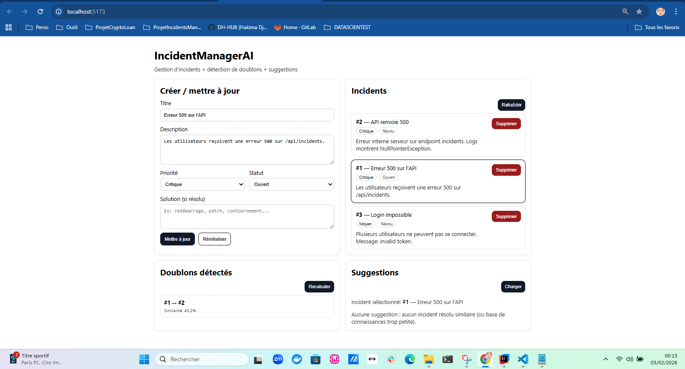
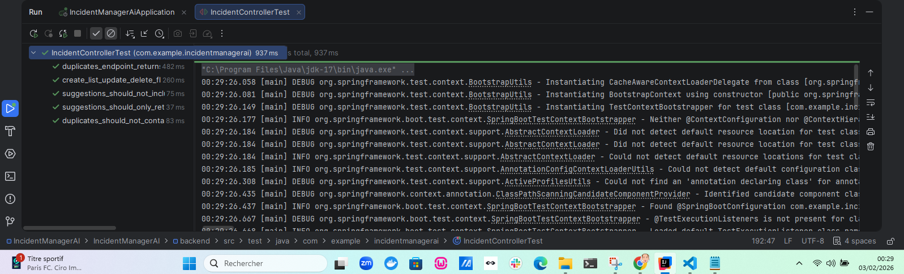
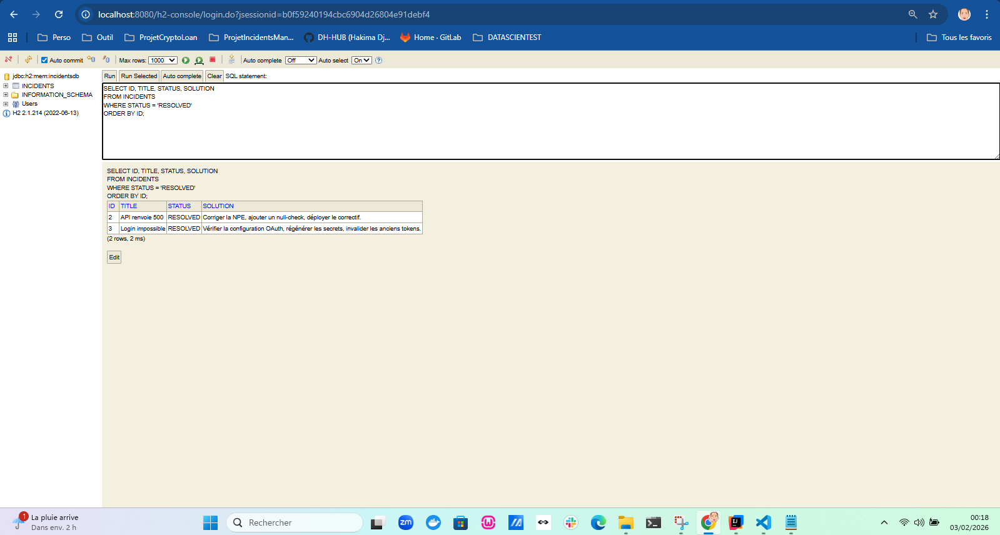

# IncidentManagerAI

IncidentManagerAI est une application légère et intelligente de gestion des incidents, construite avec **Java Spring Boot** (backend) et **Vue.js** (frontend).

Elle intègre des fonctionnalités « IA » (NLP léger) pour :

- Détecter automatiquement des **doublons** parmi les incidents signalés.
- Prioriser les incidents grâce à une gestion des degrés d’importance (**faible**, **moyen**, **critique**).
- Construire une **base de connaissances** (incidents résolus) pour **suggérer des solutions** à des incidents similaires.

---

## Demo

### Application (CRUD + doublons + suggestions)


### Tests (backend)


### Base de connaissances (H2 Console)


---

## Comment tester rapidement

### 1) Lancer le backend (Spring Boot)
```bash
cd backend
mvn spring-boot:run
```

### 2) Lancer le frontend (Vue + Vite)
```bash
cd frontend
npm install
npm run dev
```

### 3) URLs utiles
- **Frontend** : http://localhost:5173
- **API (liste incidents)** : http://localhost:8080/api/incidents
- **Doublons** : http://localhost:8080/api/incidents/duplicates
- **Suggestions (ex: incident 1)** : http://localhost:8080/api/incidents/1/suggestions

> Le frontend est configuré pour appeler l’API via un proxy Vite : `/api` → `http://localhost:8080` (voir `frontend/vite.config.js`).

### Bonus : H2 Console (base en mémoire)
- http://localhost:8080/h2-console  
  JDBC URL : `jdbc:h2:mem:incidentsdb`  
  User : `sa`  
  Password : *(vide)*

Requête “base de connaissances” (incidents résolus + solutions) :
```sql
SELECT ID, TITLE, STATUS, SOLUTION
FROM INCIDENTS
WHERE STATUS = 'RESOLVED'
ORDER BY ID;
```

---

## Structure du dépôt

- `backend/` : API REST Spring Boot (H2 + JPA)
- `frontend/` : UI Vue 3 + Vite + Axios
- `docs/screenshots/` : captures de démo (UI, tests, H2)

---

## Fonctionnalités principales

- **CRUD des incidents** : ajouter, lire, mettre à jour, supprimer
- **Gestion des priorités** : LOW / MEDIUM / CRITICAL
- **Détection des doublons** : similarité texte (titre + description)
- **Base de connaissances** : suggestions de solutions à partir d’incidents **résolus**
- **Seuils configurables** : ajustables via `application.yml` (`duplicate-threshold`, `suggestion-threshold`)

---

## Endpoints API

- `GET /api/incidents` : récupérer tous les incidents
- `GET /api/incidents/{id}` : récupérer un incident
- `POST /api/incidents` : ajouter un incident
- `PUT /api/incidents/{id}` : mettre à jour un incident
- `DELETE /api/incidents/{id}` : supprimer un incident
- `GET /api/incidents/duplicates` : détecter les doublons
- `GET /api/incidents/{id}/suggestions` : suggestions de solutions (base de connaissances)

---

## IA / Similarité texte

La détection de doublons et les suggestions utilisent une vectorisation **TF-IDF** + **cosinus**.

- Corpus : titres + descriptions des incidents
- Score : similarité cosinus entre vecteurs TF-IDF
- Dépendance : **Smile** (briques math/NLP), et implémentation TF-IDF volontairement simple pour rester léger.

> Remarque : Sur des textes courts, les scores peuvent être modestes (ex. ~0.45). Ajuster les seuils selon les données via `backend/src/main/resources/application.yml`.

---

## Tests

Backend : tests unitaires / intégration dans `backend/src/test/java/...`

```bash
cd backend
mvn test
```

Les tests peuvent utiliser un profil `test` via `backend/src/test/resources/application-test.yml` pour stabiliser les seuils et la base H2 en mémoire.

---
Copyright (c) 2026 Hakima Djermouni

## Licence

MIT — voir `LICENSE`.
